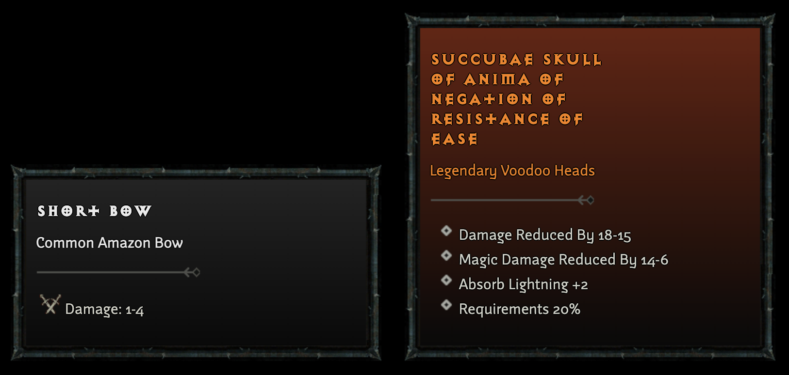

# Diablo Loot Generator
Basic weapon and armor loot name generator, based on Diablo II data. Converts original tab-delimited files from the game and parses them to generate randomized loot object names, along with stats. 

You can run it in two different ways. To generate a random list of loot items (weapons and armor), simply run:

`python database.py`

This will generate a `loot.json` file under `data` directory. Contents look something like this:

```
{
    "name": "Rune Scepter of Dexterity of the Jackal",
    "type": "Scepter",
    "tier": "Rare",
    "category": "offensive",
    "main_stats": [
        "Damage: 13-24"
    ],
    "stats": [
        "Dexterity +1-3",
        "Life +1-5"
    ]
},
{
    "name": "Mythical Sword of Vileness of the Ox of the Lamprey of Bashing",
    "type": "Sword",
    "tier": "Legendary",
    "category": "offensive",
    "main_stats": [
        "Damage: 40-50"
    ],
    "stats": [
        "Prevent Monster Heal 1",
        "Strength +6-9",
        "Life Steal 8-9%",
        "To Monster Defense Per Hit -25-40"
    ]
},
{
    "name": "Dagger of Piercing",
    "type": "Throwing Knife",
    "tier": "Magic",
    "category": "offensive",
    "main_stats": [
        "Damage: 1-4"
    ],
    "stats": [
        "Ignore Target Defense 1"
    ]
},
```

An alternative is to run the included Flask app:

```
export FLASK_APP=main
flask run
```

This will generate a new item and visualize it in an web page every time you load the page:



## Resources

- [Diablo Wiki Item Generation Tutorial](https://diablo2.diablowiki.net/Item_Generation_Tutorial)
